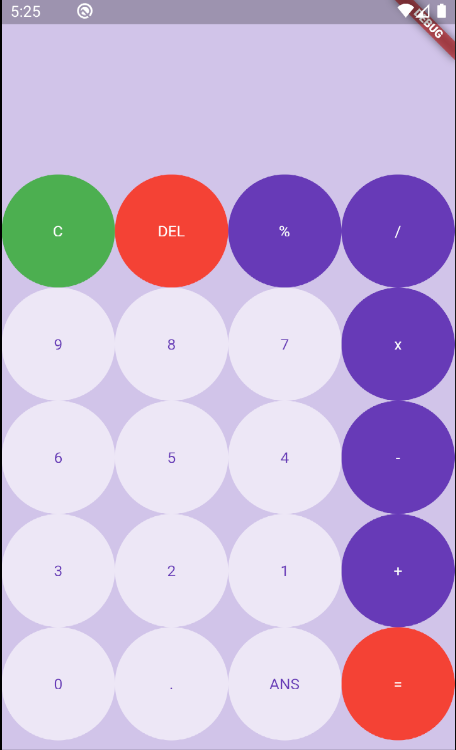

# Flutter Calculator

Using the Dart Language and the Flutter SDK. I got a basic understanding of how to create apps using Flutter. This included gaining an understanding of Widgets(Stateless and Stateful), Columns, Rows, Containers, etc. 

# Screenshots 
Inline-style: 

